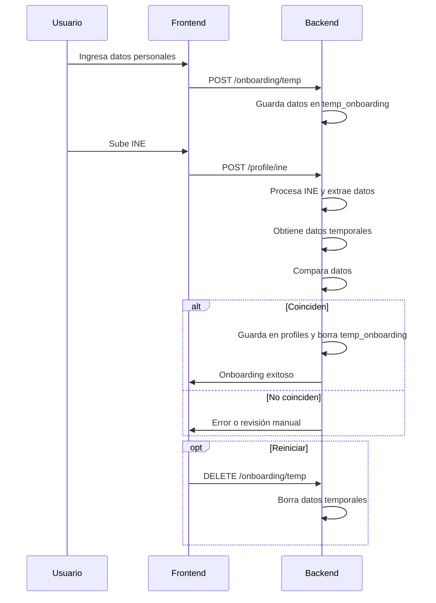

# Onboarding API Flow

Esta documentación describe el flujo de onboarding y los endpoints REST que debe consumir el frontend para capturar, validar y migrar los datos del usuario durante el proceso de registro.

---

## Resumen del flujo

1. **Captura de datos personales**
   - El usuario ingresa sus datos personales (nombre, apellidos, fecha de nacimiento, sexo, etc.).
   - El frontend los envía al backend y se almacenan temporalmente.
2. **Subida de INE**
   - El usuario sube las imágenes de su INE.
   - El backend extrae los datos y los compara con los datos temporales.
3. **Validación y migración**
   - Si los datos coinciden, se migran a la tabla definitiva (`profiles`).
   - Si no coinciden, el usuario recibe un error y puede reiniciar el proceso.
4. **Reinicio del onboarding**
   - El usuario puede borrar sus datos temporales para volver a empezar.

---

## Endpoints disponibles

### 1. Guardar o actualizar datos temporales

```
POST /onboarding/temp
Authorization: Bearer <token>
Content-Type: application/json

{
  "firstName": "Juan",
  "middleName": "Carlos",
  "lastName": "Pérez",
  "motherLastName": "García",
  "birthDate": "1990-01-01",
  "sex": "H" // o "M"
}
```

**Respuesta:**
```
{
  "success": true
}
```

---

### 2. Obtener datos temporales

```
GET /onboarding/temp
Authorization: Bearer <token>
```

**Respuesta:**
```
{
  "data": {
    "firstName": "Juan",
    ...
  }
}
```

---

### 3. Eliminar datos temporales (reiniciar onboarding)

```
DELETE /onboarding/temp
Authorization: Bearer <token>
```

**Respuesta:**
```
{
  "success": true
}
```

---

### 4. Subida y validación de INE

> **Nota:** Este endpoint ya existe, típicamente en `/profile/ine`. El backend compara los datos extraídos de la INE con los datos temporales. Si coinciden, migra el registro y borra el temporal.

---

## Diagrama de flujo



---

## Notas importantes

- Todos los endpoints requieren autenticación (token JWT de Supabase en header `Authorization`).
- El frontend debe manejar los posibles errores de validación y permitir al usuario reiniciar el proceso si es necesario.
- El endpoint de INE puede cambiar según el procesamiento backend, pero la lógica de comparación es transparente para el frontend.

---

Para dudas técnicas o cambios en el flujo, contactar al equipo de backend.
